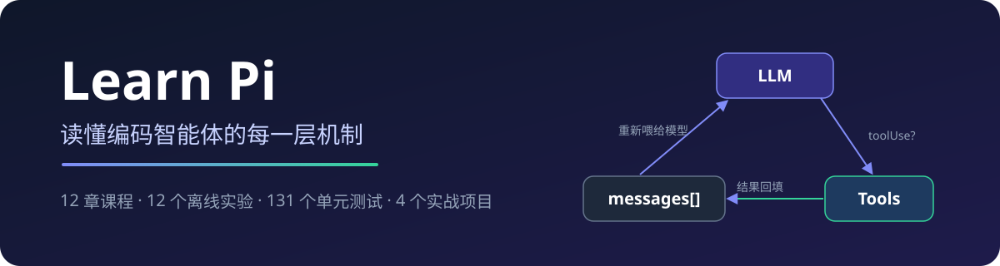
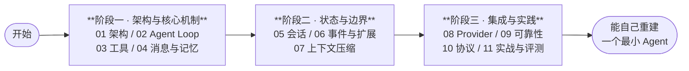

<div align="center">



[](https://whkp.github.io/learn-pi/)

**一份拆解生产级编码智能体（Coding Agent）内部机制的中文课程。**
**以 [Pi](https://github.com/earendil-works/pi) 为蓝本：每一章讲清一个机制的"是什么 / 怎么做 / 为什么"，配上可运行的 Python 实验、源码证据与失败实验。**

[在线阅读](https://whkp.github.io/learn-pi/) · [课程地图](docs/00-course-map.md) · [核心代码走读](docs/code-tour.md) · [术语表](docs/glossary.md)

</div>

---

## 为什么是这个仓库

先立一个判断：**智能来自模型，能力边界全来自 harness（包住模型的那层程序）。**

一个最小闭环定义：**agent = LLM + tool use**——它是核心循环的最小机制集，不是能力全集（Planning 由模型在循环内自主承担，Memory 拆成消息数组、会话与压缩三件机制）。模型负责语言、推理，以及决定下一步调用哪个工具；除此之外的一切——消息维护、工具注册与执行、权限、上下文、会话——都是 harness 的职责。因此 Pi 核心不内置子代理、计划模式、MCP：它们本质上都是一个工具，按需扩展，而不是塞进核心。

## ✨ 特性

- 📚 **12 章系统课程**：从架构总览到实战评测，每章一个大主题，附 [Pi 源码证据表](docs/pi-source-map.md)与失败实验
- 🧪 **12 个离线实验**：纯 Python 标准库，不调模型、不访问网络，输出确定、可复现
- ✅ **131 个单元测试 + 课程契约检查**：文档、链接、代码、站点构建全部进 CI
- 🔍 **固定源码基线**：Pi 0.85.1 @ `d981de12`，课程中的每个 Pi 行为描述都可对照源码验证
- 🛠️ **12 步构建主线**：[examples/harness](examples/harness/README.md) 从一次裸 API 调用开始，一步步长出完整 Harness
- 🌐 **配套静态站点**：无框架自研生成器，明暗双主题、Ctrl+K 中文搜索

## 🚀 快速开始

**在线阅读**（推荐）：[whkp.github.io/learn-pi](https://whkp.github.io/learn-pi/)

**本地跑第一个实验**（30 秒，只需 Python 3，无需 Node.js、无需 API Key）：

```sh
git clone https://github.com/whkp/learn-pi.git
cd learn-pi
python3 -m learn_pi_lab lab agent-loop    # 看见 Agent 循环的五步闭环
python3 -m learn_pi_lab lab mini-agent    # 最小可运行 Agent（Tau 对照）
```

**一键验证全部**（契约 + 链接 + 测试 + 站点构建）：

```sh
./scripts/build_and_check.sh
```

## 🧭 学习路径



三个阶段对应三种动手产物：**最小循环 → 会话树与事件总线 → 可评测的完整项目**。每阶段结束前，先自己重写一遍最小版本再继续。推荐入口顺序：[00 课程地图](docs/00-course-map.md) → [01 架构总览](docs/01-architecture/README.md) → [02 Agent Loop](docs/02-agent-loop/README.md)。

## 📖 课程地图

| 章节 | 大主题 | 一句话 |
| --- | --- | --- |
| [01](docs/01-architecture/README.md) | 架构总览 | Pi 分层与 Agent 产品通用骨架 |
| [02](docs/02-agent-loop/README.md) | Agent Loop | 模型如何驱动循环：Trace/Turn、stopReason |
| [03](docs/03-tools/README.md) | 工具系统 | 工具如何被声明、注册与约束 |
| [04](docs/04-messages-and-memory/README.md) | 消息与记忆 | 对话历史如何组织与传递 |
| [04b](docs/04b-system-prompt/README.md) | 系统提示词 | 五段拼装、customPrompt 与三级回退链 |
| [05](docs/05-sessions/README.md) | 会话管理 | 对话如何存储、恢复与分叉 |
| [06](docs/06-events-and-extensions/README.md) | 事件驱动与扩展 | 事件契约、subscribe vs pi.on、社区扩展 |
| [07](docs/07-context-and-compaction/README.md) | 上下文压缩 | 窗口即预算、切割点、成对不拆 |
| [08](docs/08-providers-and-models/README.md) | Provider 与模型 | 注册表、models.json、认证分离 |
| [09](docs/09-reliability/README.md) | 可靠性 | 错误分类、指数退避、错误隔离 |
| [10](docs/10-protocol-and-integration/README.md) | 协议与集成 | Print/JSON/RPC、JSONL 分帧 |
| [11](docs/11-projects-and-evaluation/README.md) | 实战与评测 | 四个 mini-project、测试与评测 |

配套资料：[Pi 源码映射](docs/pi-source-map.md)（固定基线）· [核心代码走读](docs/code-tour.md)（9 个检查点）· [术语表](docs/glossary.md)（43 词）

## 🧪 实验与项目

<details open>
<summary><b>12 个教学实验</b>（<code>python3 -m learn_pi_lab lab &lt;name&gt;</code>）</summary>

| 主题 | 命令 |
| --- | --- |
| Agent 循环 | `python3 -m learn_pi_lab lab agent-loop` |
| 最小 Agent（Tau 对照） | `python3 -m learn_pi_lab lab mini-agent` |
| 最小权限 | `python3 -m learn_pi_lab lab permissions` |
| 会话分支 | `python3 -m learn_pi_lab lab session-tree` |
| 压缩边界 | `python3 -m learn_pi_lab lab compaction` |
| 事件派发 | `python3 -m learn_pi_lab lab events` |
| 系统提示词拼装 | `python3 -m learn_pi_lab lab system-prompt` |
| Provider 目录 | `python3 -m learn_pi_lab lab providers` |
| 重试模型 | `python3 -m learn_pi_lab lab reliability` |
| JSONL RPC | `python3 -m learn_pi_lab lab rpc-jsonl` |
| 规则文件 / 资源发现 | 见 [learn_pi_lab/labs/](learn_pi_lab/labs/) 模块测试 |

</details>

<details open>
<summary><b>4 个离线实战项目</b>（由 [test_11_projects.py](tests/test_11_projects.py) 全覆盖）</summary>

| 项目 | 做什么 |
| --- | --- |
| [Session Inspector](projects/session_inspector.py) | 只读统计 JSONL 会话记录 |
| [Safe Review Runner](projects/safe_review_runner.py) | 把审查意图约束为根目录内的只读目标 |
| [CI Review Pipeline](projects/ci_review_pipeline.py) | 将课程契约、链接和单元测试汇总为稳定结果 |
| [RPC Console](projects/rpc_console.py) | 使用允许列表处理单条 JSON 请求，不启动子进程 |

</details>

## 📦 仓库结构

```text
learn-pi/
├── docs/                  # 12 章课程资料（中文，单一事实源）
│   ├── 00-course-map.md   # 课程地图与主章节清单
│   ├── 01-architecture/   # 架构总览（Pi 分层 + 通用骨架）
│   ├── ...                #   工具/消息/会话/事件/压缩/Provider/可靠/协议/实战
│   ├── code-tour.md       # 核心代码走读（9 个检查点）
│   ├── pi-source-map.md   # Pi 固定基线映射
│   └── glossary.md        # 术语表
├── learn_pi_lab/          # Python 教学实验包（仅标准库）
│   └── labs/              # 12 个实验模块
├── examples/harness/      # 构建路线：裸 API → 完整 Harness（12 步）
├── projects/              # 4 个离线实战项目
├── site/                  # 静态站点生成器（无框架，零运行时依赖）
├── scripts/               # 课程契约与链接检查、一键检查与构建
└── tests/                 # 131 个单元测试
```

## 🔄 本地开发与验证

```sh
./scripts/build_and_check.sh                  # 契约 + 链接 + 测试 + 站点构建
./scripts/build_and_check.sh --skip-build     # 只检查，不构建站点

npm ci                 # 首次安装站点依赖（仅 markdown-it 与 highlight.js）
npm run site:build     # 构建站点：docs/ → dist/
npm run site:preview   # 本地预览（http://localhost:4173）

python3 -m unittest discover -s tests -v        # 单元测试
python3 scripts/check_course_contract.py        # 课程契约
python3 scripts/check_markdown_links.py         # Markdown 链接
```

CI（[.github/workflows/pages.yml](.github/workflows/pages.yml)）在每次 push 时自动执行同样的检查并发布到 GitHub Pages。

## 🤔 教学边界与取舍

<details>
<summary><b>这个仓库刻意不教什么</b></summary>

- **不是 Pi SDK、绑定或移植版**：Pi 是 TypeScript 项目，本仓库的 Python 仅是依赖标准库的教学模型。
- **不访问网络、不调用模型、不执行学习者提供的 shell 命令**：所有实验离线、确定、可复现。
- **不覆盖 Pi 的生产细节**：认证、OAuth、权限弹窗、扩展发布流程等，请回到固定基线源码和官方文档（pi.dev）核对。

想看 Pi 的成品 Python 对照实现？请读 [Tau](https://github.com/huggingface/tau)（tau_agent / tau_ai / tau_coding），本课程的 [mini-agent 实验](learn_pi_lab/labs/mini_agent.py)就是它的最小化镜像。

</details>

<details>
<summary><b>为了让"从 0 到 1 可重建"，做了哪些取舍</b></summary>

- **核心机制高保真，外围细节从简**：循环、边界、协议、重试讲透；发布、认证、OAuth 等回到固定基线文档。
- **先教最小正确版本，再说明扩展边界**：每个 Python 实验都是标准库、离线、确定性实现。
- **教学模型 ≠ 生产实现**：示例中的固定数据和策略不可直接替代生产配置；迁移到 Pi 时用 TypeScript 重新实现并补齐权限、取消、日志脱敏和端到端测试。
- **文档跟随实现**：任何 Pi 行为描述都以固定基线源码为准，Python 侧永远标注"这不是 Pi SDK"。

</details>

## 🎯 学完你能回答什么

- Pi 的 Agent 循环里事件流如何流动？Trace 与 Turn 有什么区别？
- 为什么工具要类型化？为什么路径要在进入执行层前先检查？
- 会话为什么是 JSONL v3 而不是一个 JSON 数组？为什么必须"认父不认子"？
- subscribe 与 pi.on 有什么本质区别？压缩为什么不能拆开成对的工具调用？
- 如何用 Tau / Pi 固定基线源码交叉验证课程中的每一个说法？

如果这些问题你都能答上来，并且能自己重建一个最小版本，本课程就完成了它的任务。

**这不是"逐行复制源码"，这是"掌握真正重要的设计，然后自己重建它"。**

## License

本项目采用 [MIT License](LICENSE)。Pi 的源码版权归 earendil-works 所有。
