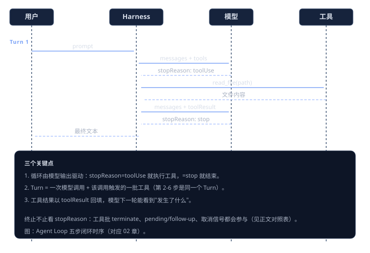
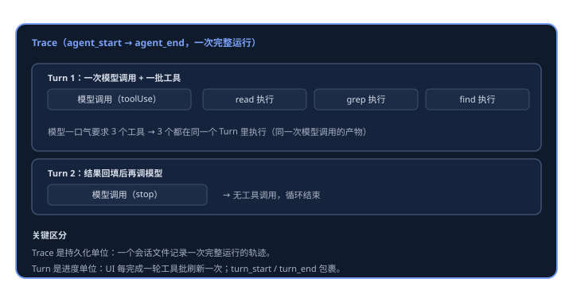

# Agent Loop —— 循环如何驱动模型工作

> 模型只会"回答问题"，不会"干活"。让它干活的那个引擎，就是 Agent Loop：把消息喂给模型，执行模型要求的工具，把结果回填，再问模型，直到模型决定停下。这一章拆解这个循环的核心设计——它为什么长这样，以及每一部分解决了什么问题。

## 学习目标

- 理解 Agent Loop 与"直接调用 LLM""Workflow"的本质区别：决策权在谁手上。
- 分清 Trace 与 Turn 两个精确概念。
- 理解循环的继续/终止由什么决定：不止 `stopReason`，还有工具批、终止提示、pending 消息与钩子。

## 一、问题：模型只说话，不干活

大模型有三种用法，区别全在"**决策权在谁手上**"：

| 用法 | 决策者 | 模型调用次数 | 典型场景 |
|------|--------|-------------|---------|
| 直接调用 | 用户 | 1 次 | 翻译、摘要、问答 |
| Workflow | 你的代码 | N 次（代码控制） | 文档流水线、RAG |
| Agent Loop | 模型 | 不确定（模型控制） | 编程助手、自动化任务 |

前两种里，流程是你写死的：第一步做什么、检查什么、第二步做什么。Agent Loop 的关键转变是：**步骤之间的流转由模型的输出内容驱动**。模型说"我要读文件"，你就去读；模型说"我知道了"，你就停。你的代码只做两件事——把输入和工具结果喂给模型；如果模型输出包含工具调用就执行它，否则结束。

工具循环的完整闭环是五步：

```
声明工具 → 模型请求调用 → 你执行 → 结果回填 → 再问模型 →（回到第 2 步）
```



## 二、两个必须分清的概念：Trace 与 Turn

## 二、两个必须分清的概念：Trace 与 Turn

- **Trace**：从 `agent_start` 到 `agent_end` 的一次完整运行，包含多个 Turn。
- **Turn**：**一次模型调用 + 该调用触发的一批工具执行**，由一对 `turn_start` / `turn_end` 包裹。

关键点：模型一口气要求 3 个工具（read + grep + find），这 3 个工具在**同一个** Turn 里执行——它们都是同一次模型调用的产物。把结果回填后再调模型，才进入下一个 Turn。



区分两者的实际意义：

- **持久化按 Trace 组织**：一个会话文件记录一次完整运行的轨迹。
- **进度与 UI 按 Turn 刷新**：每一轮工具调用是一屏进度。
- **工具结果配对按 Turn 内的调用 ID 对齐**：结果必须回填给产生它的那次调用。

## 三、什么决定继续、什么决定终止

循环的继续/终止不能只看单一信号。Pi 的决策来自**模型 API 返回值**与**框架注入状态**的合流：

| 来源 | 状态 | 对循环的影响 |
|------|------|-------------|
| 模型返回值 | `stopReason = stop` | 正常结束（若无 pending） |
| 模型返回值 | `stopReason = toolUse` + 有 toolCall | 执行工具批，继续 |
| 模型返回值 | `stopReason = error` / `aborted` | 立即终止 |
| 模型返回值 | `stopReason = length` + 有 toolCall | **全部失败这些调用**，不冒险执行 |
| 工具结果 | 本批全部 `terminate = true` | 发完 turn_end 提前终止 |
| 框架注入 | pending messages / steering | 先处理再进下一轮 |
| 框架注入 | follow-up 消息 | Agent 本可停止但被继续 |
| 框架注入 | `shouldStopAfterTurn` 钩子 | 返回 true 即提前终止 |
| 框架注入 | 取消信号 | 立即中断 |

### 两个容易误解的点

1. **`stopReason = toolUse` 不一定意味着继续**：如果工具批全部请求终止（`terminate`），循环在发完 `turn_end` 后提前结束，不再问模型。
2. **`stopReason = length` 的取舍**：token 超限时，残留的工具调用参数可能被截断、不完整。执行一个参数残缺的调用（比如删文件路径被截断）是危险的，所以 Pi 选择**全部失败这些调用**，而不是冒险执行——安全优先。

### 双层循环

循环是双层的，两层的职责不同：

```
外层（while true）              内层（while hasMoreToolCalls || pending）
  ├─ 处理 follow-up 消息          ├─ 发 turn_start
  ├─ 检查是否该停                 ├─ 流式请求 assistant 消息
  └─ 结束发 agent_end             ├─ 检查 stopReason
                                 ├─ 执行本 Turn 的一批工具
                                 └─ 发 turn_end
```

- **内层**处理"模型还要工具 + 用户中途插入的消息（steering）"；只要本轮产生了工具调用，内层就继续。
- **外层**处理"Agent 本来要停，但 follow-up 钩子又塞进了新消息"的情况——比如用户等待时又输入了一句话。

Pi 还暴露了三个钩子让产品层**不改循环也能定制行为**：`prepareNextTurn`（换模型/思考级别）、`shouldStopAfterTurn`（提前终止）、`getSteeringMessages`（注入消息）。这就是"核心可移植"在循环层的体现：循环本身是稳定的，变化都通过钩子发生。

## 当前 Pi 行为

- 循环由 pi-agent-core 提供，Provider 无关；继续/终止由 stopReason、工具批 terminate、pending/follow-up 与钩子共同决定。
- 工具执行默认并行，可全局或按工具配置为顺序；单批中全部工具请求终止才提前结束。

## 在 Pi 里怎么操作

Agent Loop 无需手动操作——启动 `pi` 后输入提示词即进入循环；TUI 里每轮工具调用、消息更新都是循环的可见投影。

## Python 实验

[mini_agent.py](../../learn_pi_lab/labs/mini_agent.py) 的 `run_agent_loop` 是同一循环的最小实现，核心只有十几行：

```python
for turn in range(1, max_turns + 1):
    assistant = _ask_model(provider, model, system, messages, tools)
    messages.append(assistant)                 # 消息数组由 harness 维护
    yield MessageStartEvent(message=assistant)
    yield MessageEndEvent(message=assistant)

    if assistant.stop_reason in {"stop", "error"}:   # stopReason 决定去留
        yield TurnEndEvent(message=assistant)
        yield AgentEndEvent(messages=tuple(messages))
        return

    for call in assistant.tool_calls:          # 一个 Turn 内的一批工具
        result = _execute_call(call, tools)
        messages.append(ToolResultMessage(
            tool_call_id=call.id, tool_name=call.name,
            content=result.content, is_error=result.is_error))
        yield ToolExecutionEndEvent(tool_name=call.name, result=result)

    yield TurnEndEvent(message=assistant)
    yield TurnStartEvent()
```

对照 Pi 的真实实现（`agent-loop.ts` 的 `runLoop`）：`_ask_model` ↔ 流式请求 assistant、`_execute_call` ↔ 执行工具批、`yield 事件` ↔ 发事件。教学模型刻意简化了三件事：无 steering/follow-up 钩子、工具只串行、无取消信号——这三个都是产品层问题，不是循环本质。循环的终止语义也做了教学简化：mini_agent 串行执行工具，任一结果 `terminate=True` 即提前结束（Pi 是并行批，需全部终止才结束）——语义方向一致，简化在并发程度。Tau 的 `tau_agent/loop.py` 是同样的循环，只是异步版并完整保留钩子。

```sh
python3 -m learn_pi_lab lab agent-loop   # 脚本化 trace：终止/未知工具/异常工具
python3 -m learn_pi_lab lab mini-agent
```

## 验证方式

```sh
python3 -m unittest tests.test_01_agent_loop tests.test_13_mini_agent -v
```

## 边界与安全

- 循环本身不设防：谁提供消息、谁执行工具、谁决定终止，由 Harness 控制。权限、速率限制、取消都必须包在循环外面。
- `max_turns` 是防止失控的最后防线；真实产品还应支持取消令牌（AbortSignal）。
- `length` 截断时宁可失败工具调用，也不要执行参数可能被截断的调用——安全优先。

## 回顾

- **决策权在模型**：步骤流转由模型输出驱动，harness 只执行。
- **Trace 是运行，Turn 是一次模型调用 + 一批工具**：持久化按 Trace，进度按 Turn。
- **终止是多方合流**：stopReason、工具批 terminate、pending/follow-up、钩子与取消共同决定；`length` 时宁可失败也不执行残缺调用。
- **双层循环 + 三个钩子**：循环稳定，变化通过钩子发生。

循环只负责"转"，工具怎么被管住、结果怎么回填，是下一章的主题——[工具系统](../03-tools/README.md)。
